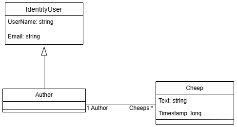
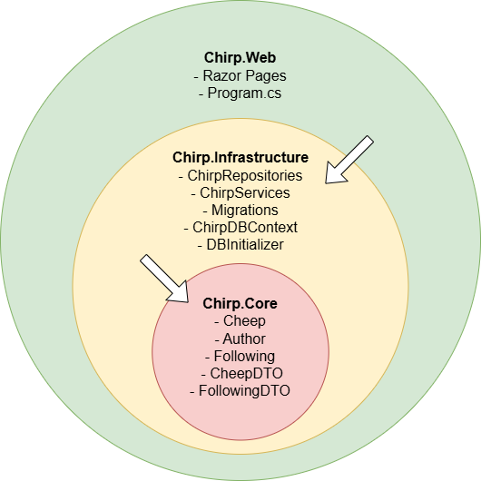
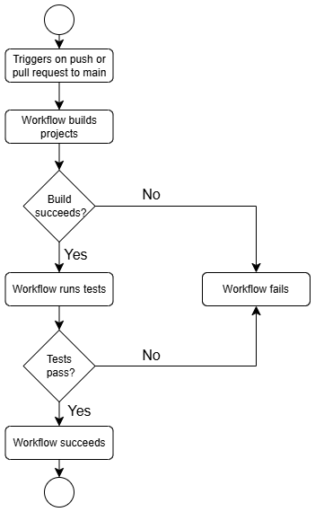
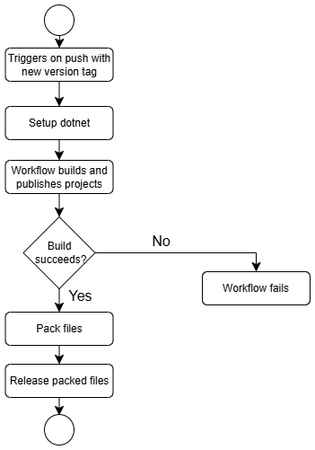
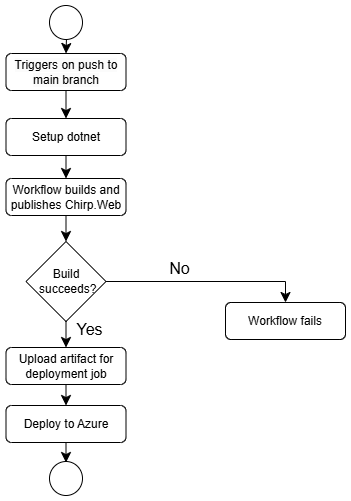

# Design and Architecture of _Chirp!_

## Domain model

<!--
Provide an illustration of your domain model.
Make sure that it is correct and complete.
In case you are using ASP.NET Identity, make sure to illustrate that accordingly.
-->

Chirp’s domain model contains the Author entity and the Cheep entity. Author is how we represent a Chirp user, and as such inherits from ASP.NET Identity’s IdentityUser to support authorization. Authors have a UserName, an Email, as well as a collection of zero to many cheeps.
Cheeps are how we represent messages sent by users. A cheep consists of a string containing the text of the cheep, the timestamp the cheep was sent and the author who sent it.



## Architecture — In the small
<!--
Illustrate the organization of your code base.
That is, illustrate which layers exist in your (onion) architecture.
Make sure to illustrate which part of your code is residing in which layer.
-->
Our project is based on the onion architecture, which we implemented using dependency injection. This approach makes it easy for us to replace layers around the domain model. The domain model is the inner layer, called Chirp.Core. The next layer is Chirp.Infrastructure, which handles our infrastructure, and the outer layer is Chirp.Web, responsible for our UI elements and Razor Pages. This is also illustrated in the image below:



The onion architecture improves testing efficiency. We test the layers in isolation using unit tests, creating mock versions of our project.

## Architecture of deployed application
<!--
Illustrate the architecture of your deployed application.
Remember, you developed a client-server application.
Illustrate the server component and to where it is deployed, illustrate a client component, and show how these communicate with each other.
-->

As can be seen below, the deployed application follows a client-server model, where the client communicates with the Azure-hosted Chirp application using HTTP. The server interacts with an SQLite database, which stores data such as cheeps, following relationships, and author information. The client sends HTTP requests to the server, which processes the requests and retrieves data from the database to respond appropriately.

While it is not shown in the illustration, if a user decides to log in with their GitHub account, a call to GitHub OAuth is made.


## User activities
<!--
Illustrate typical scenarios of a user journey through your _Chirp!_ application.
That is, start illustrating the first page that is presented to a non-authorized user, illustrate what a non-authorized user can do with your _Chirp!_ application, and finally illustrate what a user can do after authentication.

Make sure that the illustrations are in line with the actual behavior of your application.
-->

Here can be seen three of the most typical user scenarios: logging in and out, sending a cheep and following another user, and finally, accessing the 'about me' page along with deleting the user's profile. The first scenario starts when the user is not authorized, while the latter two occur when the user is authorized. It should be noted that sending a cheep can be done from all timelines.

It should be noted that a cheep cannot be longer than 160 characters, and if a cheep is blank, a warning appears.

  


## Sequence of functionality/calls trough _Chirp!_
<!--
With a UML sequence diagram, illustrate the flow of messages and data through your _Chirp!_ application.
Start with an HTTP request that is send by an unauthorized user to the root endpoint of your application and end with the completely rendered web-page that is returned to the user.

Make sure that your illustration is complete.
That is, likely for many of you there will be different kinds of "calls" and responses.
Some HTTP calls and responses, some calls and responses in C# and likely some more.
(Note the previous sentence is vague on purpose. I want that you create a complete illustration.)
-->

When accessing the Chirp Azure website, whether you are an authorized or unauthorized user, the HTTP request begins by retrieving the Chirp application for the public timeline. This process involves the `GetCheeps` call, which collects all the cheeps from the database and sends them back. The `ReadCheepDTO` then returns a specific number of cheeps, as well as the number of cheeps to skip, to be displayed on the public timeline before returning the page to the user.


# Process


## Build, test, release, and deployment
<!--
Illustrate with a UML activity diagram how your _Chirp!_ applications are build, tested, released, and deployed.
That is, illustrate the flow of activities in your respective GitHub Actions workflows.

Describe the illustration briefly, i.e., how your application is built, tested, released, and deployed.
-->

The processes of building, testing, releasing and deploying, have all been automated using GitHub workflows, to minimize time and effort spent on these tasks. We have three workflows to do these: “Build and Test”, “Automatic Release” and the mostly auto generated “main_bdsagroup024chirprazor”

### Build and Test
This workflow runs on every push or pull request to the main branch and has the purpose of ensuring that the newly pushed code doesn’t cause any of our tests to fail and informs us what needs to be looked at. If the workflow runs to completion, we can be confident that any new features don’t interfere with our old ones. 



### Release
The release workflow only runs when a new version tag is pushed. We thought that automatic releases on every push was unnecessary, and only making a new release when a new feature was added was enough. Unfortunately, we often forgot to add version tags when appropriate, which has led to a lack of releases throughout development.



### Deployment
This workflow was mostly automatically generated by Azure to set up deployment. We only changed the workflow to deploy the correct directory.



## Team work
<!--
Show a screenshot of your project board right before hand-in.
Briefly describe which tasks are still unresolved, i.e., which features are missing from your applications or which functionality is incomplete.

Briefly describe and illustrate the flow of activities that happen from the new creation of an issue (task description), over development, etc. until a feature is finally merged into the `main` branch of your repository.
-->
The photo below shows our project board.

(OBS! Insert photo of project board before submit)

There are two unresolved issues: both the playwright test and unit testing. These are unresolved because we wanted to add more tests to the ones we have.  (OBS! We can elaborate on this before submission.)

At the beginning of the project, we verbally agreed to maintain good group practices and use the tools we learned in a group work course from our first semester.
Our workflow is shown in the illustrations below. The first illustration reflects how we actually worked, while the second illustrates how our workflow should have been to optimize collaboration and workflow.

 

For this project, we agreed to create issues for each task from ‘README’ that had to be implemented and completed in Chirp. However, we didn't have a clear structure for how to structure these issues. We later were made aware that using checkboxes for issues provides a better overview of progress and makes it easier for others to continue working on them. Some of the newer issues therefore have checkboxes but still did not follow any formal template. 

After creating an issue one or more people from the group assigned themselves to the issue. When assigned, one starts working on the issue. We often approve each other’s work as we develop it or when coding together, as shown in the first illustration. There should have been a better process with pull requests and then another person reviewing to approve the code. This is a better practice, as we have learned in this course. This is seen in the second illustration.

## How to make _Chirp!_ work locally
<!--
There has to be some documentation on how to come from cloning your project to a running system.
That is, Adrian or Helge have to know precisely what to do in which order.
Likely, it is best to describe how we clone your project, which commands we have to execute, and what we are supposed to see then.
-->

To run the Chirp application locally, first clone the repository from Github. Then navigate to the Chirp/src/Chirp.Web directory, open a terminal and run the command:
```
dotnet run
```
After populating the example database, you should now see a localhost address in the terminal, enter said address into the browser of your choice and you should see the public timeline of  the Chirp application.

## How to run test suite locally
<!--
List all necessary steps that Adrian or Helge have to perform to execute your test suites.
Here, you can assume that we already cloned your repository in the step above.

Briefly describe what kinds of tests you have in your test suites and what they are testing.
-->

From the repository root this time, open a terminal and run the command:
```
dotnet test
```
We currently have Playwright end-to-end tests which require Chirp to be running locally first.
These end-to-end tests, tests the existence of the correct UI elements, as well as testing the register, login, send cheep and logout functionality.
We also have unit tests, testing functions from Chirp.Infrastructure.

# Ethics

## Data processing

<!--
Not stated as mandatory but felt right to add
-->

For our data processing, we rely on legitimate interest as the legal basis for handling a limited amount of user data. This data is strictly necessary to provide the core functionalities of the application. For transparency and uphold of users data privacy rights, we have implemented features that allow users to view their stored data and delete their account, along with all associated data.

Additionally, Cheeps may contain personal data. However, as these messages are user-generated content shared publicly, we do not control the type of information disclosed, and it is considered public information provided by the user.

We acknowledge that, even with these minor implementations, a dedicated privacy policy page would have been a valuable addition to clearly disclose our data processing practices.


## License
<!--
State which software license you chose for your application.

-->

We decided to go with the MIT License for our Chirp application. This license is a highly permissive open-source license that allows anyone to freely use, modify, and distribute our code, even for proprietary or closed-source projects.

We chose this license with the belief that, if our work could be helpful to anyone, they should be allowed to use it freely. While it is unlikely that this will happen, we have no stake in the project beyond its academic purpose, making the MIT License the most suitable choice.

Furthermore, all the libraries we use are either also licensed under the MIT License or are in the public domain, so our choice of license does not conflict with any of them.


## LLMs, ChatGPT, CoPilot, and others
<!--
State which LLM(s) were used during development of your project.
In case you were not using any, just state so.
In case you were using an LLM to support your development, briefly describe when and how it was applied.
Reflect in writing to which degree the responses of the LLM were helpful.
Discuss briefly if application of LLMs sped up your development or if the contrary was the case.


-->

During the development of Chirp, both ChatGPT, CoPilot, and Codeium were used. The idea was that if an LLM was used to generate code, it would be credited as a co-author of that part. However, if it was only used for tasks like sparring (e.g., finding a small syntax error or reading grammatical errors in the report), the group felt that these changes were so minuscule that crediting the LLM as a co-author was unnecessary. 

In the end, the use of LLMs was seen as overall helpful, especially in cases where one had simply lost a bit of oversight. However, when LLMs were used to generate pieces of code, they were often unsatisfactory, and our own implementation would supersede it. Even though the example provided by the LLM could sometimes be unhelpful, it still occasionally served as inspiration.

To sum up, the use of LLMs is most effective when you already have a clear idea of what you want the result to be. 

